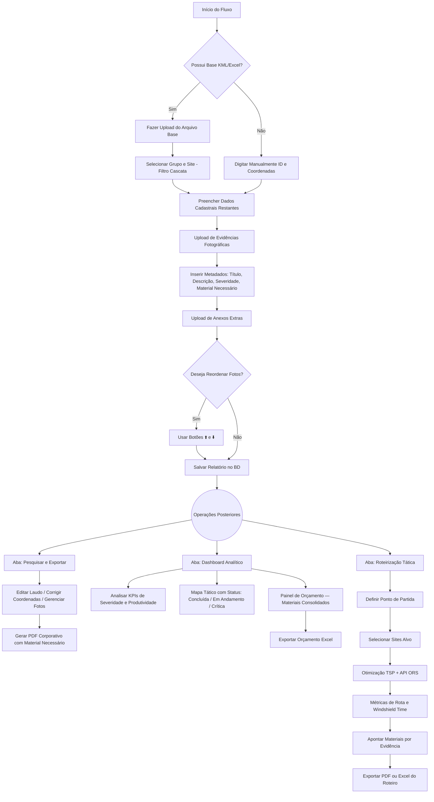

# ⚡ GIRCP - Gerador Inteligente de Relatórios e Controle Fotográfico

Aplicação web de missão crítica desenvolvida em Python com Streamlit para criação, edição, gerenciamento analítico e exportação de relatórios fotográficos técnicos (laudos corporativos) em PDF, seguindo padrões de excelência corporativa.

---

## ✨ O que há de novo na v3.7.3 (Performance e Refatoração)?

Esta atualização traz melhorias profundas na arquitetura, performance e limpeza do código, focando em escalabilidade e segurança:
* **Geração de PDF Otimizada:** A função `gerar_pdf` agora renderiza o documento apenas uma vez utilizando WeasyPrint; o hash é calculado diretamente sobre os bytes resultantes e injetado via `bytes.replace()`, evitando re-renderizações desnecessárias.
* **Alertas de Malware no Estado:** O scanner `scan_malware_async` agora grava nomes de arquivos suspeitos na fila `_malware_alertas` dentro do `session_state`. O app consome essa fila após o `init_db()` e exibe as notificações com `st.error` no próximo *rerun*.
* **Concorrência e Banco de Dados (Thread-safe):** A numeração de relatórios em `proximo_numero_relatorio` agora utiliza `UPDATE ... RETURNING ultimo`, executando incremento e leitura em um *statement* atômico.
* **Otimização Logística (O(n) → O(1)):** A busca na roteirização foi otimizada utilizando `set_index` (`df_idx.loc[s]`), substituindo o lento loop de filtragem inline (`df[df['site_id'] == s].iloc[0]`).
* **Modularização UI (`_widget_materiais`):** Um bloco duplicado de aproximadamente 18 linhas foi extraído para uma função única com `session_key` parametrizável, sendo agora chamada dinamicamente por `tela_novo` e `_render_item_edicao`.
* **Padronização de Severidades:** Foram introduzidas as constantes globais `_SEV_CANONICAL` e `_SEV_COR`, centralizando o tratamento via a nova função `normalizar_sev(s)` e eliminando 7 dicionários repetidos pelo código.
* **Limpeza de Código (`_row_get`):** Eliminado o padrão verboso de acesso (`row['x'] if 'x' in row.keys()...`) em 14 ocorrências nas funções `_render_cadastrais` e `_tratar_botoes_acao_pdf`.
* **Otimização de Renderização:** O `import urllib.parse` foi movido para o topo do arquivo (saindo do loop de `_btn_destaque_js`), e o CSS foi transformado na constante estática `_CSS_GLOBAL`, reduzindo a aplicação de estilo a uma única linha.
* **Documentação Técnica:** A função `_obter_b64_de_foto` recebeu comentários explícitos sobre o padrão legado (caminho-primeiro / base64-fallback), orientando desenvolvedores a não utilizarem base64 inline para novos registros.

---

## ✨ O que há de novo na v3.7.2 (Blindagem SecOps)?

A versão 3.7.2 introduz uma blindagem robusta de infraestrutura de missão crítica (SecOps), focada em defesa em profundidade, mitigação de vazamentos e proteção do Sistema Operacional:
* **Varredura Assíncrona (ClamAV):** Imagens enviadas passam por uma varredura silenciosa em background via `subprocess` e `threading`. Arquivos políglotas ou maliciosos são deletados do servidor imediatamente.
* **Autenticação Fail-Closed & Anti-Bruteforce:** O sistema bloqueia acessos de forma global caso a credencial de segurança no arquivo `st.secrets` seja removida. Implementação de trava temporária após 5 tentativas de login incorretas.
* **Prevenção de Information Disclosure:** Erros de parser (falhas ao ler planilhas ou KMLs) não "vazam" mais *Stack Traces* na interface do usuário. As falhas são registradas silenciosamente no log de auditoria interno.
* **Proteção Anti-DoS e Trava de SO:** Limite de tamanho de upload (`maxUploadSize`) ativado no Streamlit para barrar bombas de descompressão, além do travamento da pasta de imagens com restrições (`chmod 755` e `644`) impedindo a execução de qualquer script no diretório.

---

## ✨ Histórico — v3.6.0

A versão 3.6.0 transforma o campo de material livre em um painel estruturado de itens por evidência, permitindo controle completo de quantidade, unidade e custo unitário para geração de orçamentos precisos.

### 🔧 Materiais por Evidência — Estrutura de Orçamento
O campo "Material Necessário" foi reformulado de texto livre para um painel de itens por linha, disponível no cadastro de novos laudos e na edição de laudos existentes:[cite: 1]
* **4 colunas por item:** Descrição | Unidade (un / m / kg / kit / cx / hr) | Quantidade | Custo Unitário R$.[cite: 1]
* Botão **＋ Adicionar material** para múltiplos itens por evidência e botão ❌ para remover.[cite: 1]
* **Subtotal por evidência** calculado em tempo real quando o custo é informado.[cite: 1]
* **Retrocompatível:** laudos antigos com material em texto puro são migrados automaticamente para a nova estrutura ao abrir para edição.[cite: 1]
* O campo `material_necessario` legado é mantido como string concatenada para não quebrar exportações existentes.[cite: 1]

### 💰 Painel de Orçamento no Dashboard[cite: 1]
Nova seção "Painel de Orçamento — Materiais Necessários" ao final do Dashboard Analítico:[cite: 1]
* **4 KPIs:** Total Estimado (R$) / Itens Críticos / Materiais Distintos / Itens sem Custo Informado.[cite: 1]
* **Tabela consolidada** com todos os materiais de todos os laudos filtrados, exibindo site, evidência, severidade, material, unidade, quantidade, custo unitário e total por linha.[cite: 1]
* **Filtro por severidade** (Todas / Critico / Observacao / Normal).[cite: 1]
* **Exportação Excel** do orçamento completo com um clique.[cite: 1]
* Alerta automático quando há itens sem custo unitário preenchido, indicando que o total estimado pode estar incompleto.[cite: 1]

### 📄 PDF do Laudo — Tabela de Materiais[cite: 1]
O bloco de material no PDF do laudo foi atualizado de texto simples para mini-tabela por evidência:[cite: 1]
* Colunas: Material | Un. | Qtd. | Unit. R$ | Total R$.[cite: 1]
* Subtotal por evidência em destaque vermelho.[cite: 1]
* Evidências sem material continuam sem o bloco, sem poluir o documento.[cite: 1]

---

## ✨ Histórico — v3.5.0[cite: 1]

A versão 3.5.0 expandiu o módulo de Roteirização Tática com exportação completa de roteiros, rastreamento de materiais por evidência e inteligência de status no mapa tático do Dashboard.[cite: 1]

### 📤 Exportação de Roteiro (PDF e Excel)[cite: 1]
Após otimizar a rota, um novo painel de exportação é gerado automaticamente abaixo do mapa:[cite: 1]
* **PDF do Roteiro:** Documento A4 corporativo com KPIs operacionais (sites atendidos, quilometragem, windshield time, densidade), resumo de severidades, tabela de sequenciamento com coordenadas e seção de evidências com thumbs fotográficos e materiais apontados por site.[cite: 1]
* **Planilha Excel (.xlsx):** Três abas estruturadas — *KPIs da Operação*, *Sequenciamento* e *Evidências e Materiais* — com formatação condicional por severidade (verde/amarelo/vermelho).[cite: 1]
* **Persistência de estado:** Os arquivos gerados ficam disponíveis para download mesmo após interações subsequentes na interface, via `session_state`.[cite: 1]

### 🔧 Campo "Material Necessário" nas Evidências[cite: 1]
Novo campo adicionado ao formulário de cada foto, tanto no cadastro de novos laudos quanto na edição de laudos existentes:[cite: 1]
* Aparece logo abaixo do campo **Descrição** em cada evidência.[cite: 1]
* Salvo no banco de dados junto com os demais metadados da foto.[cite: 1]
* Exibido no **PDF do laudo** com destaque visual (borda vermelha) quando preenchido.[cite: 1]
* Exibido na **planilha e PDF do roteiro** na coluna "Material Necessário" por site.[cite: 1]
* Preservado corretamente ao reordenar (⬆️⬇️) ou excluir evidências.[cite: 1]

### 🗺️ Mapa Tático com Status de Visitas[cite: 1]
O mapa do Dashboard foi reformulado para exibir o andamento operacional de cada site:[cite: 1]
* 🟢 **Concluída** — relatório com evidências fotográficas cadastradas.[cite: 1]
* 🟠 **Em Andamento** — relatório cadastrado mas sem fotos ainda.[cite: 1]
* 🔴 **Anomalia Crítica** — visita concluída com evidência de severidade Crítica detectada.[cite: 1]
* **Seletor de filtro** (radio horizontal) para exibir apenas um status no mapa.[cite: 1]
* **3 contadores** acima do mapa: Concluídas / Em Andamento / Com Anomalia Crítica.[cite: 1]
* **Tooltip enriquecido** com ícone de status, alerta de anomalia, técnico, data e endereço.[cite: 1]
* **Legenda lateral** explicando cada cor diretamente na interface.[cite: 1]

---

## ✨ Histórico — v3.4.1[cite: 1]

A versão 3.4.1 trouxe inteligência logística e renderização antibloqueio:[cite: 1]
* **Módulo de Roteirização (Field Service):** Algoritmo do Vizinho Mais Próximo (TSP local) integrado à API do OpenRouteService (ORS) para sequenciamento de atendimento, trajeto rua a rua e métricas de *Windshield Time*, Quilometragem e Densidade da Rota.[cite: 1]
* **Cartografia Avançada (PyDeck):** Substituição do motor gráfico nativo. Renderização em RGB condicional e tooltips interativos, com numeração da ordem de visitação dos sites.[cite: 1]
* **Segurança e Sanitização (Anti-XSS e SQLi):** Blindagem contra injeção de scripts e queries SQL parametrizadas.[cite: 1]
* **Geolocalização Flexível:** Importação de `.KML` e `.XLSX` com filtros em cascata, mais inserção manual de coordenadas.[cite: 1]
* **Compressão On-the-Fly:** Otimização de imagens no upload via PIL/Pillow.[cite: 1]
* **Reordenação Dinâmica:** Reordenação de evidências fotográficas antes de salvar ou durante edição.[cite: 1]
* **Geração Autonumérica:** Número sequencial automático de relatório (`GIRCP-YYYY-XXXX`) e controle de revisão.[cite: 1]

---

## 🛠️ Funcionalidades Principais[cite: 1]

* **Cadastro de Laudos:** Formulário completo para identificação da infraestrutura, dados do cliente, metadados da vistoria e coordenadas GPS.[cite: 1]
* **Evidências com Metadados Completos:** Upload múltiplo com título, descrição, severidade, categoria e **material necessário para correção** por foto.[cite: 1]
* **Banco de Dados Local Otimizado:** SQLite com `PRAGMA journal_mode=WAL`, metadados em JSON e imagens comprimidas em disco.[cite: 1]
* **Motor de Edição:** Pesquisa, expansão de card, edição de textos e coordenadas, reordenação e adição de novas fotos inline.[cite: 1]
* **PDF Corporativo:** WeasyPrint renderizando HTML/CSS com marca d'água, logotipo, badges de severidade, campo de material necessário, assinatura digital e rodapé LGPD.[cite: 1]
* **Dashboard Analítico:** KPIs gerais, gráfico de produtividade por site, distribuição de severidade, mapa tático com status de visitas, linha do tempo de vistorias e **painel de orçamento** consolidado com exportação Excel.[cite: 1]
* **Controle de Orçamento:** Materiais estruturados por evidência (descrição, unidade, quantidade, custo unitário), subtotal por foto, total consolidado por laudo e visão gerencial no Dashboard.[cite: 1]
* **Roteirização Tática:** Otimização TSP + ORS, mapa de rota, métricas de field service, painel de evidências/materiais por site e exportação em PDF e Excel.[cite: 1]

---

## 💻 Tecnologias Utilizadas[cite: 1]

| Biblioteca | Papel |
|---|---|
| **Streamlit** | Interface web e gerenciamento de estado (`session_state`)[cite: 1] |
| **PyDeck** | Mapas táticos geoespaciais com camadas e tooltips[cite: 1] |
| **Plotly** | Gráficos analíticos (barras, pizza, linha do tempo)[cite: 1] |
| **SQLite3** | Banco de dados relacional embutido (WAL mode)[cite: 1] |
| **WeasyPrint** | Renderização HTML/CSS para PDF A4 corporativo[cite: 1] |
| **Pandas** | Manipulação e análise de DataFrames[cite: 1] |
| **OpenPyXL** | Geração de planilhas Excel com formatação condicional[cite: 1] |
| **Requests** | Integração com API OpenRouteService (ORS)[cite: 1] |
| **Pillow (PIL)** | Compressão e redimensionamento de imagens[cite: 1] |
| **xml.etree** | Extração de coordenadas de arquivos KML[cite: 1] |
| **ClamAV & OS Mods** | Varredura assíncrona antimalware (`subprocess`, `threading`)[cite: 1] |
| **Auxiliares** | `base64`, `json`, `os`, `datetime`, `hashlib`, `math`, `urllib`[cite: 1] |

---

## ⚙️ Instalação e Execução[cite: 1]

**1. Clone o repositório**[cite: 1]
```bash
git clone [https://github.com/CLAUDEVANI/GIRCP.git](https://github.com/CLAUDEVANI/GIRCP.git)
cd GIRCP

**2. Crie e ative o ambiente virtual**
```bash
python -m venv meu_ambiente
source meu_ambiente/bin/activate  # Linux/Mac
meu_ambiente\Scripts\activate     # Windows
```

**3. Instale as dependências**
```bash
pip install streamlit weasyprint pandas openpyxl pillow plotly pydeck requests
```

**4. Execute**
```bash
streamlit run app_relatorio.py
```

A aplicação abre em `http://localhost:8501`. Senha padrão configurável via `st.secrets` (chave `senha_acesso`), default: `GIRCP2026`.

---

## 🔄 Fluxograma de Utilização



---

## 🔒 Segurança e Conformidade

* Controle de acesso por senha configurável via `st.secrets`.
* Sanitização de todos os inputs com `html.escape` (Anti-XSS).
* Queries SQL 100% parametrizadas (Anti-SQLi).
* Rodapé LGPD em todos os PDFs gerados.
* Dados armazenados localmente — sem envio a servidores externos (exceto API ORS, opcional).