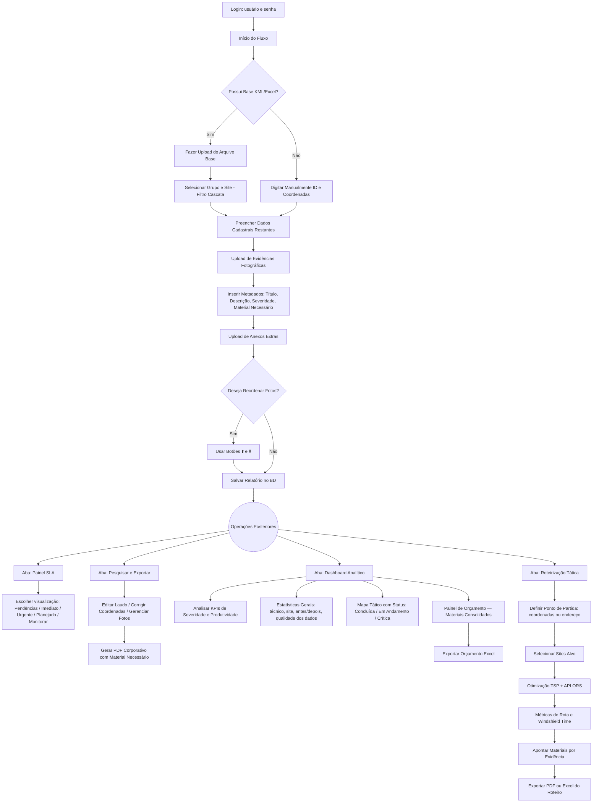

# ⚡ GIRCP - Gerador Inteligente de Relatórios e Controle Fotográfico

Aplicação web de missão crítica desenvolvida em Python com Streamlit para criação, edição, gerenciamento analítico e exportação de relatórios fotográficos técnicos (laudos corporativos) em PDF, seguindo padrões de excelência corporativa.

---

## ✨ O que há de novo na v3.9.0 (Estatísticas, Painel SLA e Roteirização)?

Esta versão deixa o Dashboard e o Painel SLA mais enxutos para visualização e corrige distorções nos indicadores:
* **Estatísticas Gerais no Dashboard:** nova seção com 5 KPIs (taxa de criticidade, média de evidências por laudo, SLA imediato + urgente, custo estimado e laudos sem evidência) e 5 abas: *Por técnico*, *Por site (risco)*, *Antes / Depois*, *Status dos laudos* e *Qualidade dos dados* (laudos sem GPS, sem data, críticas sem material e materiais sem custo). Tudo parte de uma tabela única com uma linha por evidência, evitando contagens divergentes entre blocos.
* **Nome do técnico padronizado:** nas estatísticas e filtros, o registro profissional (`CRT`, `CREA`, `CFT`) é removido do nome e a caixa é padronizada, agrupando variações do mesmo técnico. O banco não é alterado. Nomes diferentes da mesma pessoa podem ser unificados em `_ALIAS_TECNICO`. No cadastro, o campo *Técnico em Campo* não traz mais o CRT embutido; o registro fica em *ART / RRT*.
* **Ocultar registros de teste:** opção nos filtros do Dashboard e nas *Opções* do Painel SLA (ligada por padrão) que oculta laudos cujo técnico contém "teste" e informa quantos foram ocultados.
* **Painel SLA enxuto:** o seletor *Pendências / Imediato / Urgente / Planejado / Monitorar / Todos* (com contagens) mostra só o que for escolhido; o padrão exibe as pendências com prazo ativo. A faixa de status muda de cor (vermelha com imediatos, laranja com urgentes, azul em dia), os cards ficam compactos (sem descrição vazia e sem selo "Normal") e a lista mostra 24 itens por vez, com botão *Mostrar mais*. Severidade e auto-refresh ficam recolhidos em *Opções*.
* **Ponto de partida editável na Roteirização:** o campo aceita coordenadas (`lat,lon`) ou um endereço, convertido em coordenadas pelo Nominatim/OpenStreetMap (somente Brasil). O ponto 0 aparece como **BASE** na rota.
* **Correção:** a coluna SLA da tabela de laudos do Dashboard passou a mostrar o prazo mais urgente entre as evidências (antes mostrava o da primeira foto).

---

## ✨ O que há de novo na v3.8.0 (Controle de Acesso e Integridade)?

Esta versão troca a senha única por login individual e adiciona proteção contra adulteração do código e de dados exportados:
* **Login por usuário e perfil:** a tela de acesso ganhou o campo *Usuário*. Usuários e perfis (`administrador`, `tecnico`) são definidos em `st.secrets` (bloco `[usuarios.<nome>]`). Com o campo em branco, vale a senha geral `senha_acesso` (compatível com a versão anterior).
* **Auditoria com identidade real:** o log passa a registrar o usuário autenticado, e não mais o nome digitável na sidebar, que podia ser falsificado.
* **Backup do banco restrito:** o download completo do `.db` só aparece para o perfil `administrador`.
* **Selo de integridade do código:** o SHA-256 do `app_relatorio.py` é comparado com o valor guardado em `st.secrets` (`[seguranca] hash_codigo`, gerado por `selar_codigo.py`). Se o arquivo for alterado, o app bloqueia o acesso antes do login e registra o evento na auditoria. Com a variável de ambiente `GIRCP_EXIGIR_SELO=1`, a ausência do selo também bloqueia.
* **PDF sem recursos externos:** o WeasyPrint só carrega `data:` URIs, bloqueando `http(s)://` e `file://` (proteção contra SSRF e leitura de arquivos locais).
* **Excel sem injeção de fórmulas:** textos iniciados por `=`, `+`, `-` ou `@` são gravados como texto literal nas três exportações (orçamento, roteiro e evidências).

---

## ✨ O que há de novo na v3.7.3 (Performance e Refatoração)?

Esta atualização traz melhorias profundas na arquitetura, performance e limpeza do código, focando em escalabilidade e segurança:
* **Geração de PDF Otimizada:** A função `gerar_pdf` agora renderiza o documento apenas uma vez utilizando WeasyPrint; o hash é calculado diretamente sobre os bytes resultantes e injetado via `bytes.replace()`, evitando re-renderizações desnecessárias.
* **Alertas de Malware no Estado:** O scanner `scan_malware_async` agora grava nomes de arquivos suspeitos na fila `_malware_alertas` dentro do `session_state`. O app consome essa fila após o `init_db()` e exibe as notificações com `st.error` no próximo *rerun*.
* **Concorrência e Banco de Dados (Thread-safe):** A numeração de relatórios em `proximo_numero_relatorio` agora utiliza `UPDATE ... RETURNING ultimo`, executando incremento e leitura em um *statement* atômico.
* **Otimização Logística (O(n) → O(1)):** A busca na roteirização foi otimizada utilizando `set_index` (`df_idx.loc[s]`), substituindo o lento loop de filtragem inline (`df[df['site_id'] == s].iloc[0]`).
* **Modularização UI (`_widget_materiais`):** Um bloco duplicado de aproximadamente 18 linhas foi extraído para uma função única com `session_key` parametrizável, sendo agora chamada dinamicamente por `tela_novo` e `_render_item_edicao`.
* **Padronização de Severidades:** Foram introduzidas as constantes globais `_SEV_CANONICAL` e `_SEV_COR`, centralizando o tratamento via a nova função `normalizar_sev(s)` e eliminando 7 dicionários repetidos pelo código.
* **Limpeza de Código (`_row_get`):** Eliminado o padrão verboso de acesso (`row['x'] if 'x' in row.keys()...`) em 14 ocorrências nas funções `_render_cadastrais` e `_tratar_botoes_acao_pdf`.
* **Otimização de Renderização:** O `import urllib.parse` foi movido para o topo do arquivo (saindo do loop de `_btn_destaque_js`), e o CSS foi transformado na constante estática `_CSS_GLOBAL`, reduzindo a aplicação de estilo a uma única linha.
* **Documentação Técnica:** A função `_obter_b64_de_foto` recebeu comentários explícitos sobre o padrão legado (caminho-primeiro / base64-fallback), orientando desenvolvedores a não utilizarem base64 inline para novos registros.

---

## ✨ Histórico — v3.7.2 (Blindagem SecOps)

A versão 3.7.2 introduziu uma blindagem robusta de infraestrutura de missão crítica (SecOps), focada em defesa em profundidade, mitigação de vazamentos e proteção do Sistema Operacional:
* **Varredura Assíncrona (ClamAV):** Imagens enviadas passam por uma varredura silenciosa em background via `subprocess` e `threading`. Arquivos políglotas ou maliciosos são deletados do servidor imediatamente.
* **Autenticação Fail-Closed & Anti-Bruteforce:** O sistema bloqueia acessos de forma global caso a credencial de segurança no arquivo `st.secrets` seja removida. Implementação de trava temporária após 5 tentativas de login incorretas.
* **Prevenção de Information Disclosure:** Erros de parser (falhas ao ler planilhas ou KMLs) não "vazam" mais *Stack Traces* na interface do usuário. As falhas são registradas silenciosamente no log de auditoria interno.
* **Proteção Anti-DoS e Trava de SO:** Limite de tamanho de upload (`maxUploadSize`) ativado no Streamlit para barrar bombas de descompressão, além do travamento da pasta de imagens com restrições (`chmod 755` e `644`) impedindo a execução de qualquer script no diretório.

---

## ✨ Histórico — v3.6.0

A versão 3.6.0 transforma o campo de material livre em um painel estruturado de itens por evidência, permitindo controle completo de quantidade, unidade e custo unitário para geração de orçamentos precisos.

### 🔧 Materiais por Evidência — Estrutura de Orçamento
O campo "Material Necessário" foi reformulado de texto livre para um painel de itens por linha, disponível no cadastro de novos laudos e na edição de laudos existentes:
* **4 colunas por item:** Descrição | Unidade (un / m / kg / kit / cx / hr) | Quantidade | Custo Unitário R$.
* Botão **＋ Adicionar material** para múltiplos itens por evidência e botão ❌ para remover.
* **Subtotal por evidência** calculado em tempo real quando o custo é informado.
* **Retrocompatível:** laudos antigos com material em texto puro são migrados automaticamente para a nova estrutura ao abrir para edição.
* O campo `material_necessario` legado é mantido como string concatenada para não quebrar exportações existentes.

### 💰 Painel de Orçamento no Dashboard
Nova seção "Painel de Orçamento — Materiais Necessários" ao final do Dashboard Analítico:
* **4 KPIs:** Total Estimado (R$) / Itens Críticos / Materiais Distintos / Itens sem Custo Informado.
* **Tabela consolidada** com todos os materiais de todos os laudos filtrados, exibindo site, evidência, severidade, material, unidade, quantidade, custo unitário e total por linha.
* **Filtro por severidade** (Todas / Critico / Observacao / Normal).
* **Exportação Excel** do orçamento completo com um clique.
* Alerta automático quando há itens sem custo unitário preenchido, indicando que o total estimado pode estar incompleto.

### 📄 PDF do Laudo — Tabela de Materiais
O bloco de material no PDF do laudo foi atualizado de texto simples para mini-tabela por evidência:
* Colunas: Material | Un. | Qtd. | Unit. R$ | Total R$.
* Subtotal por evidência em destaque vermelho.
* Evidências sem material continuam sem o bloco, sem poluir o documento.

---

## ✨ Histórico — v3.5.0

A versão 3.5.0 expandiu o módulo de Roteirização Tática com exportação completa de roteiros, rastreamento de materiais por evidência e inteligência de status no mapa tático do Dashboard.

### 📤 Exportação de Roteiro (PDF e Excel)
Após otimizar a rota, um novo painel de exportação é gerado automaticamente abaixo do mapa:
* **PDF do Roteiro:** Documento A4 corporativo com KPIs operacionais (sites atendidos, quilometragem, windshield time, densidade), resumo de severidades, tabela de sequenciamento com coordenadas e seção de evidências com thumbs fotográficos e materiais apontados por site.
* **Planilha Excel (.xlsx):** Três abas estruturadas — *KPIs da Operação*, *Sequenciamento* e *Evidências e Materiais* — com formatação condicional por severidade (verde/amarelo/vermelho).
* **Persistência de estado:** Os arquivos gerados ficam disponíveis para download mesmo após interações subsequentes na interface, via `session_state`.

### 🔧 Campo "Material Necessário" nas Evidências
Novo campo adicionado ao formulário de cada foto, tanto no cadastro de novos laudos quanto na edição de laudos existentes:
* Aparece logo abaixo do campo **Descrição** em cada evidência.
* Salvo no banco de dados junto com os demais metadados da foto.
* Exibido no **PDF do laudo** com destaque visual (borda vermelha) quando preenchido.
* Exibido na **planilha e PDF do roteiro** na coluna "Material Necessário" por site.
* Preservado corretamente ao reordenar (⬆️⬇️) ou excluir evidências.

### 🗺️ Mapa Tático com Status de Visitas
O mapa do Dashboard foi reformulado para exibir o andamento operacional de cada site:
* 🟢 **Concluída** — relatório com evidências fotográficas cadastradas.
* 🟠 **Em Andamento** — relatório cadastrado mas sem fotos ainda.
* 🔴 **Anomalia Crítica** — visita concluída com evidência de severidade Crítica detectada.
* **Seletor de filtro** (radio horizontal) para exibir apenas um status no mapa.
* **3 contadores** acima do mapa: Concluídas / Em Andamento / Com Anomalia Crítica.
* **Tooltip enriquecido** com ícone de status, alerta de anomalia, técnico, data e endereço.
* **Legenda lateral** explicando cada cor diretamente na interface.

---

## ✨ Histórico — v3.4.1

A versão 3.4.1 trouxe inteligência logística e renderização antibloqueio:
* **Módulo de Roteirização (Field Service):** Algoritmo do Vizinho Mais Próximo (TSP local) integrado à API do OpenRouteService (ORS) para sequenciamento de atendimento, trajeto rua a rua e métricas de *Windshield Time*, Quilometragem e Densidade da Rota.
* **Cartografia Avançada (PyDeck):** Substituição do motor gráfico nativo. Renderização em RGB condicional e tooltips interativos, com numeração da ordem de visitação dos sites.
* **Segurança e Sanitização (Anti-XSS e SQLi):** Blindagem contra injeção de scripts e queries SQL parametrizadas.
* **Geolocalização Flexível:** Importação de `.KML` e `.XLSX` com filtros em cascata, mais inserção manual de coordenadas.
* **Compressão On-the-Fly:** Otimização de imagens no upload via PIL/Pillow.
* **Reordenação Dinâmica:** Reordenação de evidências fotográficas antes de salvar ou durante edição.
* **Geração Autonumérica:** Número sequencial automático de relatório (`GIRCP-YYYY-XXXX`) e controle de revisão.

---

## 🛠️ Funcionalidades Principais

* **Cadastro de Laudos:** Formulário completo para identificação da infraestrutura, dados do cliente, metadados da vistoria e coordenadas GPS.
* **Evidências com Metadados Completos:** Upload múltiplo com título, descrição, severidade, categoria e **material necessário para correção** por foto.
* **Banco de Dados Local Otimizado:** SQLite com `PRAGMA journal_mode=WAL`, metadados em JSON e imagens comprimidas em disco.
* **Motor de Edição:** Pesquisa, expansão de card, edição de textos e coordenadas, reordenação e adição de novas fotos inline.
* **PDF Corporativo:** WeasyPrint renderizando HTML/CSS com marca d'água, logotipo, badges de severidade, campo de material necessário, assinatura digital e rodapé LGPD.
* **Dashboard Analítico:** KPIs gerais, estatísticas por técnico, site e status, qualidade dos dados, gráfico de produtividade por site, distribuição de severidade, mapa tático com status de visitas, linha do tempo de vistorias e **painel de orçamento** consolidado com exportação Excel.
* **Controle de Orçamento:** Materiais estruturados por evidência (descrição, unidade, quantidade, custo unitário), subtotal por foto, total consolidado por laudo e visão gerencial no Dashboard.
* **Roteirização Tática:** Ponto de partida por coordenadas ou endereço, otimização TSP + ORS, mapa de rota, métricas de field service, painel de evidências/materiais por site e exportação em PDF e Excel.
* **Controle de Acesso:** Login por usuário e perfil, log de auditoria com identidade autenticada e selo de integridade do código.
* **Painel SLA:** tela dedicada (TV ou celular) com seletor de visualização por prazo (Pendências, Imediato, Urgente, Planejado, Monitorar), cards compactos e auto-refresh opcional.

---

## 💻 Tecnologias Utilizadas

| Biblioteca | Papel |
|---|---|
| **Streamlit** | Interface web e gerenciamento de estado (`session_state`) |
| **PyDeck** | Mapas táticos geoespaciais com camadas e tooltips |
| **Plotly** | Gráficos analíticos (barras, pizza, linha do tempo) |
| **SQLite3** | Banco de dados relacional embutido (WAL mode) |
| **WeasyPrint** | Renderização HTML/CSS para PDF A4 corporativo |
| **Pandas** | Manipulação e análise de DataFrames |
| **OpenPyXL** | Geração de planilhas Excel com formatação condicional |
| **Requests** | Integração com a API OpenRouteService (ORS) e geocodificação Nominatim/OpenStreetMap |
| **Pillow (PIL)** | Compressão e redimensionamento de imagens |
| **defusedxml** | Leitura segura de KML (proteção contra XXE e XML Bomb) |
| **filetype** | Validação de uploads por magic bytes |
| **qrcode** | Geração do QR Code de verificação nos PDFs |
| **ClamAV & OS Mods** | Varredura assíncrona antimalware (`subprocess`, `threading`) |
| **Auxiliares** | `base64`, `json`, `os`, `datetime`, `hashlib`, `hmac`, `math`, `urllib` |

---

## ⚙️ Instalação e Execução

**1. Clone o repositório** (privado: requer acesso cadastrado no GitHub)
```bash
git clone git@github.com:CLAUDEVANI/GIRCP.git
cd GIRCP
```

**2. Crie e ative o ambiente virtual**
```bash
python -m venv meu_ambiente
source meu_ambiente/bin/activate  # Linux/Mac
meu_ambiente\Scripts\activate     # Windows
```

**3. Instale as dependências do sistema** (Ubuntu/Debian)
```bash
sudo apt install libpango-1.0-0 libpangoft2-1.0-0   # exigidas pelo WeasyPrint
sudo apt install clamav clamav-daemon               # varredura de uploads (recomendado)
```
Sem o `clamdscan` o app funciona, mas os uploads não são escaneados (o erro é registrado na auditoria).

**4. Instale as dependências Python**
```bash
pip install streamlit weasyprint pandas openpyxl pillow plotly pydeck requests defusedxml filetype qrcode
```

**5. Configure o acesso** (veja a seção *Configuração de Acesso* abaixo)

**6. Execute**
```bash
streamlit run app_relatorio.py
```

A aplicação abre em `http://localhost:8501` (ou na porta definida em `.streamlit/config.toml`).

---

## 🔑 Configuração de Acesso

O app **não tem senha padrão**: sem credenciais em `st.secrets`, o acesso é negado (*fail-closed*). Crie `.streamlit/secrets.toml` (já está no `.gitignore`; **nunca versione este arquivo**):

```toml
# Senha geral (login com o campo Usuário em branco). Deve ficar ANTES das tabelas.
senha_acesso = "troque-esta-senha"

[usuarios.admin]
senha  = "troque-esta-senha"
perfil = "administrador"
nome   = "Nome do Administrador"

[usuarios.tecnico1]
senha  = "troque-esta-senha"
perfil = "tecnico"
nome   = "Técnico em Campo"

# Selo de integridade do código (opcional, veja a próxima seção). Deve ficar no FINAL.
[seguranca]
hash_codigo = "gerado-por-selar_codigo.py"
```

* **Perfis:** `administrador` vê o botão de backup do banco; `tecnico` não. O campo `nome` preenche o "Técnico em campo" da sidebar, usado nos roteiros exportados (o formulário de novo laudo tem campo próprio).
* **Desativar a senha geral:** remova `senha_acesso`. O login sem usuário passa a falhar e só os usuários nominais entram.
* Use senhas fortes e únicas, e restrinja o arquivo: `chmod 600 .streamlit/secrets.toml`.

---

## 🛡️ Proteção Contra Adulteração do Código

O selo compara o SHA-256 do `app_relatorio.py` com o valor guardado fora dele (em `secrets.toml`). Se divergir, o app não inicia o fluxo de login.

```bash
python selar_codigo.py                          # imprime o bloco [seguranca]
# cole o bloco no FINAL de .streamlit/secrets.toml
chmod 444 app_relatorio.py selar_codigo.py      # somente leitura
sudo chattr +i app_relatorio.py                 # trava forte (nem o dono edita ou apaga)
GIRCP_EXIGIR_SELO=1 streamlit run app_relatorio.py
```

**Para editar o código depois de selado:**
```bash
sudo chattr -i app_relatorio.py
# ... editar ...
python selar_codigo.py                          # gera o novo hash; atualize o secrets.toml
sudo chattr +i app_relatorio.py
```

> O selo sozinho não impede quem já tem escrita no arquivo de apagar a verificação. A proteção real vem da combinação de permissões do sistema de arquivos, `chattr +i` e da variável `GIRCP_EXIGIR_SELO=1` definida **fora** dos arquivos do projeto. Idealmente, execute o Streamlit com um usuário que só tenha escrita no banco (`.db`) e em `banco_fotos_gircp/`.

---

## 🌐 Implantação Segura

Em `.streamlit/config.toml`, para uso apenas local:

```toml
[server]
address = "127.0.0.1"
enableCORS = true
enableXsrfProtection = true
maxUploadSize = 20
```

Se outras pessoas precisarem acessar, mantenha a porta restrita por firewall à rede interna ou publique o app atrás de um proxy reverso com HTTPS. Não exponha a porta diretamente à internet.

---

## 🔄 Fluxograma de Utilização


```mermaid
graph TD
    LG[Login: usuário e senha] --> A[Início do Fluxo]
    A --> B{Possui Base KML/Excel?}
    B -- Sim --> C[Fazer Upload do Arquivo Base]
    C --> D[Selecionar Grupo e Site - Filtro Cascata]
    B -- Não --> E[Digitar Manualmente ID e Coordenadas]
    D --> F[Preencher Dados Cadastrais Restantes]
    E --> F
    F --> G[Upload de Evidências Fotográficas]
    G --> H[Inserir Metadados: Título, Descrição, Severidade, Material Necessário]
    H --> I[Upload de Anexos Extras]
    I --> J{Deseja Reordenar Fotos?}
    J -- Sim --> K[Usar Botões ⬆️ e ⬇️]
    K --> L[Salvar Relatório no BD]
    J -- Não --> L

    L --> M((Operações Posteriores))

    M --> N[Aba: Pesquisar e Exportar]
    M --> O[Aba: Dashboard Analítico]
    M --> U[Aba: Roteirização Tática]
    M --> AC[Aba: Painel SLA]
    AC --> AD[Escolher visualização: Pendências / Imediato / Urgente / Planejado / Monitorar]

    N --> P[Editar Laudo / Corrigir Coordenadas / Gerenciar Fotos]
    P --> Q[Gerar PDF Corporativo com Material Necessário]

    O --> R[Analisar KPIs de Severidade e Produtividade]
    O --> AE[Estatísticas Gerais: técnico, site, antes/depois, qualidade dos dados]
    O --> S[Mapa Tático com Status: Concluída / Em Andamento / Crítica]
    O --> T[Painel de Orçamento — Materiais Consolidados]
    T --> AB[Exportar Orçamento Excel]

    U --> V[Definir Ponto de Partida: coordenadas ou endereço]
    V --> W[Selecionar Sites Alvo]
    W --> X[Otimização TSP + API ORS]
    X --> Y[Métricas de Rota e Windshield Time]
    Y --> Z[Apontar Materiais por Evidência]
    Z --> AA[Exportar PDF ou Excel do Roteiro]
```

---

## 🔒 Segurança e Conformidade

* **Acesso:** login por usuário e perfil via `st.secrets`, comparação de senha em tempo constante (`hmac.compare_digest`), *fail-closed* sem credenciais e bloqueio temporário após 5 tentativas incorretas.
* **Integridade do código:** selo SHA-256 verificado na inicialização (veja *Proteção Contra Adulteração do Código*).
* **Injeção:** sanitização de todos os inputs com `html.escape` (Anti-XSS), queries SQL 100% parametrizadas (Anti-SQLi) e proteção contra injeção de fórmulas nas planilhas exportadas.
* **Uploads:** validação por magic bytes, limite de 20 MB por arquivo, recompressão da imagem com Pillow, varredura ClamAV assíncrona e bloqueio de *path traversal*.
* **PDF:** o WeasyPrint só carrega `data:` URIs (sem acesso a rede ou a arquivos locais).
* **Auditoria:** eventos de login, bloqueios, backups, malware e violação de integridade são registrados com o usuário autenticado.
* **Backup:** o download completo do banco é restrito ao perfil `administrador`.
* **LGPD:** rodapé em todos os PDFs gerados. Dados armazenados localmente, sem envio a servidores externos (exceto a API ORS, opcional, que recebe apenas coordenadas e o token informado, e o Nominatim/OpenStreetMap, usado só quando um endereço é digitado como ponto de partida e que recebe apenas esse texto).
* **Repositório:** `secrets.toml`, bancos `.db`, `banco_fotos_gircp/` e relatórios gerados (`Relatorio_*.pdf` etc.) estão no `.gitignore` e não devem ser versionados.

### Limitações conhecidas

* O contador de tentativas de login é **por sessão do navegador**: recarregar a página o reinicia. Para exposição além da rede interna, use também limitação de taxa no proxy reverso.
* As senhas ficam em texto puro no `secrets.toml` (protegido por permissão de arquivo). Não reutilize senhas de outros sistemas.
* A varredura ClamAV roda depois do salvamento do arquivo; o aviso ao usuário pode não ser exibido, embora o arquivo suspeito seja removido.
* Sem token do OpenRouteService, a distância da rota é a soma de trechos em linha reta e o tempo estimado assume 40 km/h; use o token para distância e tempo por vias reais.
* O SLA ainda não tem status de fechamento por evidência: os contadores mostram o que foi registrado em cada prazo, sem distinguir pendência aberta de resolvida. O indicador *Antes sem Depois* é apenas aproximado.
* As estatísticas por técnico dependem de o nome ser digitado de forma consistente: a padronização só remove o registro profissional e ajusta a caixa (variações como "Nome" e "Nome Sobrenome" exigem `_ALIAS_TECNICO`). Laudos já gravados mantêm o nome original no banco.
* A geocodificação por endereço depende de internet e a precisão do número varia no Nominatim; confira as coordenadas exibidas antes de otimizar a rota.